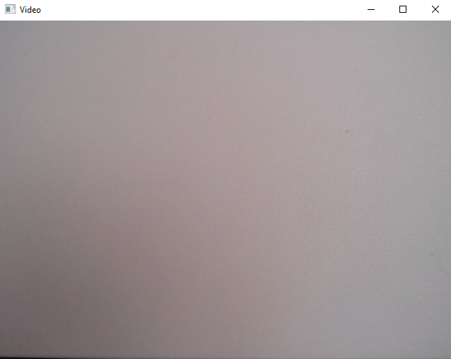
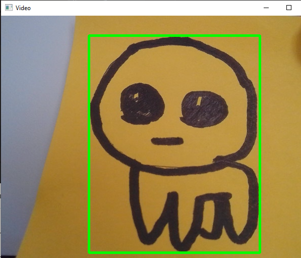
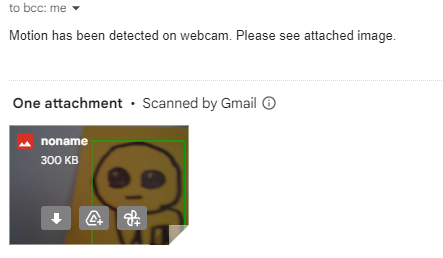

# Motion Detector

This is a simple motion detection program written with the OpenCV library. It's the first of my practice with computer vision.

It works by first creating an initial keyframe,
and then "detects" movement and new objects entering the frame by taking in new frame data, obscuring the frames, changing
the color values of the keyframe to black and the new frames to white, 
grabbing the area of the now white object in the frame, and then comparing it back to the keyframe to outline the new object.

It functions like so:

This is the key frame (a blank background of my PC tower.)

By introducing a new object, the program notices the change from the keyframe and outlines
the object triggering it.

Once the object leaves the frame, an email is sent to my email notifying me my webcam detected motion and containing an 
attachment that takes a frame from the video showcasing the object.

